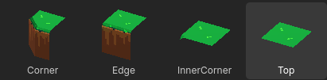
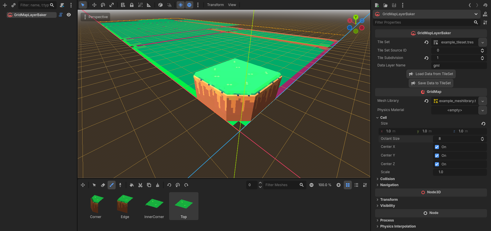
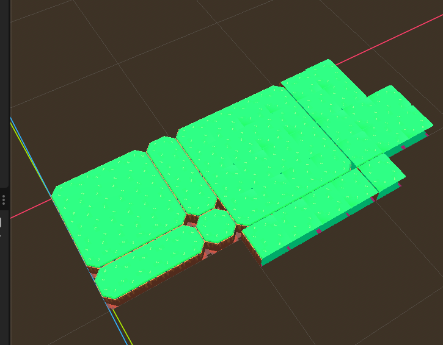
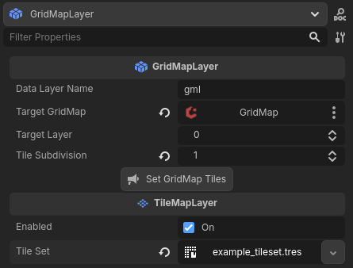
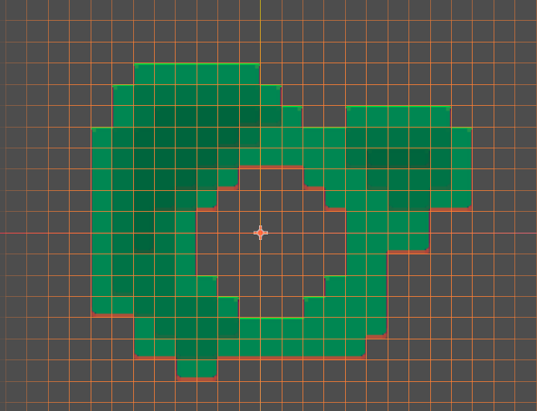
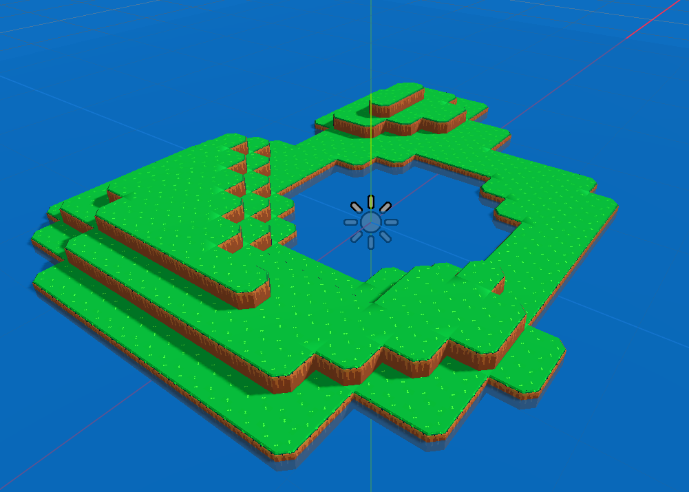

# GridMapLayer

This is a Godot addon for managing GridMaps through TileMapLayers!

## Examples

A couple of example scenes are provided:
- `example/example_scene.tsn`
	- Three GridMapLayers targeting one GridMap, creating a 3D island.
- `example/example_layer_baking.tscn`
	- A single GridMapLayerBaker, showing how a tileset is configured and gridmap tiles are placed over it.

## Getting Started

To get started you'll need a few things

1. A TileSet resource. GridMapLayer saves the information for tile placement in the custom data layers.
	- This only works with Atlas sources! And it assumes the atlas has no padding between tiles (currently!)
	

2. A MeshLibrary. GridMapLayerBaker will use the ids to save to the TileSet.
	- For a tileset with 1 subdivision (making it a 2x2 grid), you can get away with just four tiles! The same is true r any higher subdivision counts.

### Using GridMapLayerBaker

To utilize this addon, you'll need to first write data to your TileSet, so that GridMapLayers will know how to place them.

GridMapLayerBaker is the tool to write that data. It's a tool script built on top of GridMap and it renders a Sprite3D of your tileset to assist in placing the data.

1. Create a new Scene and add a GridMapLayerBaker node (or set it as the root node)
1. Set the Tile Set field to your TileSet
1. Set the source ID to the source of the texture you want to create gridmap tiles for
1. Optional: Set the tile subdivision (In our example's case, we want a 2x2 grid per tile, so 1 subdivision)
1. Optional: Set the data layer name (using gml is fine if you're only planning on using one set if grid tiles per tileset)
1. Set the Mesh Library. Make sure your cell cize matches the meshlibrary cells size. 
1. Start placing Grid Tiles *over* your tileset. 
  - When you're done you should have a representation of your 2D tileset in 3D gridmap form, along one layer.

1. Press the `Save Data to TileSet` button
	- This will write the tileset placement and orientations to each tile on the custom data layer named earlier.
	- To make sure this worked properly, you can move your tiles *off* of the tileset using the copy tool in GridMap and erase the ones over the tileset. Press `Load Data from TileSet` and they should reappear!

### Using GridMapLayer

GridMapLayer inherits from TileMapLayer and handles the additional functionality of setting GridMapTiles.

1. Set the data layer name that was used when baking the data 
1. Set the target GridMap (This is where GridMap tiles will be set)
1. Set the target layer
1. Set the tile subdivision (This should match what was used when baking the data)
1. Draw your map like you would with any other TileMapLayer
1. Press `Set GridMap Tiles` to set the gridmap cells! 
	- This won't clear the GridMap, you'll need to manage that manually through GridMap tools.
1. Repeat this for any other layers to build a layered scene!

